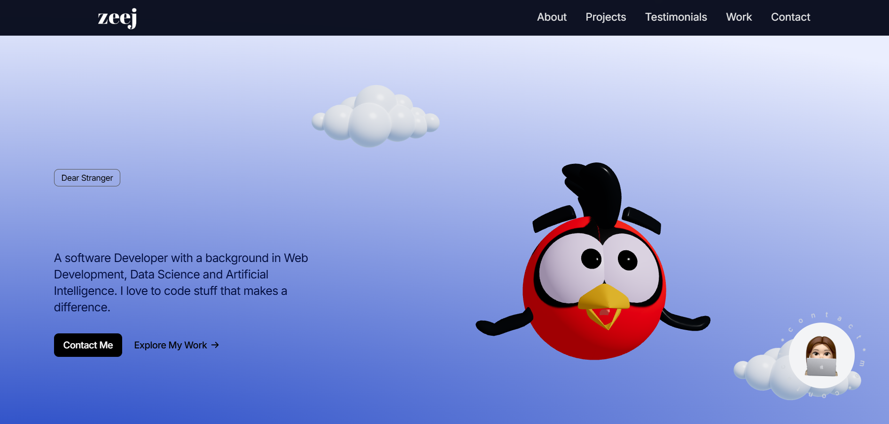

# 🚀 Zanjeel's Portfolio - A Modern Web Experience



Welcome to my corner of the web! This portfolio is built with cutting-edge technologies to showcase my work in the most engaging way possible. Check out the [live demo](https://zanjeel-portfolio.netlify.app/) ✨

## 🛠️ Tech Stack

This portfolio is powered by some awesome technologies:

```bash
🎨 Next.js 14 - For blazing fast performance
🎭 Framer Motion - For smooth animations
🎪 Three.js - For 3D magic
🌈 Tailwind CSS - For beautiful styling
⚡ TypeScript - For type-safe code
🎯 React - For component-based UI
```

## 🚀 Getting Started

1. **Clone the repository**
```bash
git clone https://github.com/yourusername/portfolio-bento.git
cd portfolio-bento
```

2. **Install dependencies**
```bash
npm install
# or
yarn install
# or
pnpm install
```

3. **Run the development server**
```bash
npm run dev
# or
yarn dev
# or
pnpm dev
```

4. **Open your browser**
```bash
Navigate to http://localhost:3000 - Your portfolio awaits! 🎉
```

## 🎨 Features

- 🌓 Smooth animations and transitions
- 🎭 Interactive 3D elements
- 📱 Fully responsive design
- ⚡ Lightning-fast performance
- 🎯 Modern UI/UX principles
- 🎪 Custom cursor effects
- 🌈 Dynamic content loading

## 📦 Dependencies

```json
{
  "next": "^14.0.0",
  "react": "^18.0.0",
  "framer-motion": "^10.0.0",
  "three": "^0.158.0",
  "tailwindcss": "^3.3.0",
  "typescript": "^5.0.0"
}
```

## 🤝 Contributing

Feel free to contribute to this project! Whether it's:
- 🐛 Fixing bugs
- ✨ Adding new features
- 📚 Improving documentation
- 🎨 Enhancing design

1. Fork the repository
2. Create your feature branch (`git checkout -b feature/AmazingFeature`)
3. Commit your changes (`git commit -m 'Add some AmazingFeature'`)
4. Push to the branch (`git push origin feature/AmazingFeature`)
5. Open a Pull Request

## 📝 License

This project is open source and available under the MIT License.

## 🌟 Let's Connect!

Found this interesting? Let's connect! Feel free to reach out if you have any questions or just want to chat about web development!

---
Made with ❤️ by Zanjeel T. Sahi
